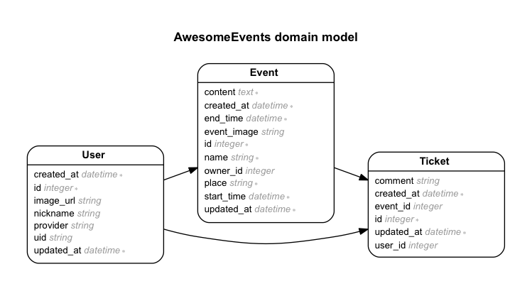

Rails再入門
===
# 目的
パーフェクトRuby on Rails再入門

# 前提
| ソフトウェア     | バージョン    | 備考         |
|:---------------|:-------------|:------------|
| OS X           |10.8.5        |             |
| rvm       　　　|1.26.3        |             |
| ruby      　　　|2.1.5         |             |
| rails          |4.2.0         |             |
| ChefDK         |0.3.5         |             |

# 構成
+ [Railsアプリケーション開発](#1)
+ [Railsアプリケーションのテスト](#2)
+ [Railsのインフラと運用](#3)
+ [Railsを拡張する](#4)

# 詳細
## <a name="1">Railsアプリケーション開発</a>
### イベント告知アプリケーションを作る
#### ER図

### アプリケーションの作成と下準備
+ rails newでアプリケーションの作成

```bash
$ gem install rails --no-ri --no-rdoc
$ rails new awesome_events -T
```
+ _awesome_events/Gemfile_
+ _awesome_events/Procfile_
+ _awesome_events/config/environments/development.rb_

```bash
$ cd awesome_events
$ bundle
$ guard init shell
$ guard init livereload
$ guard init foreman
$ guard init yard
```

+ 独自のトップページを表示してみる
```bash
$ ./bin/rails g controller welcome index
```
+ _awesome_events/config/routes.rb_

+ Bootstrapを導入
```bash
$ rails g bootswatch:install
```
+ _awesome_events/app/views/layouts/application.html.erb_

### OAuthを利用して「Twitterでログイン」機能を作る

+ Twitterアプリケーションの登録
  https://apps.twitter.com/app

+ Twitterアカウントでログインする機能の作成
+ omniauthのインストールと設定
  + _awesome_events/Gemfile_
  + _awesome_events/config/secrets.yml_
  + _awesome_events/config/initializers/omniauth.rb_
+ ユーザーのモデルを作成する  
+ _awesome_events/app/models/user.rb_
  + _awesome_events/db/migrate/20141229073105_create_users.rb_
+ ログイン処理を作成する  
+ _awesome_events/app/views/layouts/application.html.erb_
+ _awesome_events/app/controllers/sessions_controller.rb_
  + _awesome_events/app/models/user.rb_
  + _awesome_events/config/routes.rb_
+ ログアウト処理を作成する  
  + _awesome_events/app/controllers/sessions_controller.rb_
  + _awesome_events/app/controllers/application_controller.rb_
  + _awesome_events/app/views/layouts/application.html.erb_
  + _awesome_events/config/routes.rb_

### イベントの登録機能を作る
+ タイムゾーンを設定する
  + _awesome_events/config/application.rb_

+ イベント用のモデルを作成する
  ```bash
  $ rails g resource event owner_id:integer name:string place:string start_time:datetime end_time:datetime content:text
  ```
  + _awesome_events/db/migrate/20141230042853_create_events.rb_
  + _awesome_events/app/models/event.rb_
  + _awesome_events/app/views/layouts/application.html.erb_

+ ログイン状態を管理する処理を作る
  + _awesome_events/app/controllers/application_controller.rb_
  + _awesome_events/app/views/layouts/application.html.erb_
  + _awesome_events/app/controllers/events_controller.rb_
  + _awesome_events/app/models/user.rb_

+ イベント用登録フォームを作る
  + _awesome_events/app/views/events/new.html.erb_

+ i18nの設定をする
  + _awesome_events/Gemfile_  
  + _awesome_events/config/application.rb_
  + _awesome_events/config/locales/ar_ja.yml_

### イベントの閲覧機能を作る  
+ イベント詳細ページの作成
  + awesome_events/app/controllers/events_controller.rb
  + awesome_events/app/views/events/show.html.erb
  + awesome_events/app/models/event.rb

+ イベント一覧ページの作成
  + awesome_events/app/views/welcome/index.html.erb
  + awesome_events/app/controllers/welcome_controller.rb

### イベントの編集・削除機能を作る
+ イベント編集機能を作る
  + _awesome_events/app/views/events/show.html.erb_
  + _awesome_events/app/models/event.rb_
  + _awesome_events/app/controllers/events_controller.rb_
  + _awesome_events/app/views/events/edit.html.erb_
+ イベント削除機能を作る
  + _awesome_events/app/views/events/show.html.erb_
  + _awesome_events/app/controllers/events_controller.rb_

### 登録されたイベントへの参加機能、参加キャンセル機能を作る
+ イベント参加機能の追加
  + _awesome_events/app/controllers/tickets_controller.rb_
  + _awesome_events/db/migrate/20141230082456_create_tickets.rb_
  + _awesome_events/app/models/ticket.rb_
  + _awesome_events/app/models/user.rb_
  + _awesome_events/app/models/event.rb_
  + _awesome_events/app/views/events/show.html.erb_
  + _awesome_events/app/controllers/tickets_controller.rb_
  + _awesome_events/app/assets/javascripts/tickets.js.coffee_
  + _awesome_events/config/locales/ar_ja.yml_
  + _awesome_events/app/helpers/application_helper.rb_
  + _awesome_events/app/controllers/events_controller.rb_
+ イベント参加をキャンセルする機能の作成
  + _awesome_events/app/views/events/show.html.erb_
  + _awesome_events/app/controllers/events_controller.rb_
  + _awesome_events/app/controllers/tickets_controller.rb_
  + _awesome_events/app/models/ticket.rb_

### 退会機能を作る
+ 退会用コントーローラ、ビュー、ルーティングの作成
    ```bash
    $ rails g controller users
    ```
    + _awesome_events/app/views/layouts/application.html.erb_
    + _awesome_events/app/views/users/retire.html.erb_
    + _awesome_events/config/routes.rb_
+ 退会処理の作成
    + _awesome_events/app/controllers/users_controller.rb_
    + _awesome_events/app/models/user.rb_
    + _awesome_events/app/views/events/show.html.erb_  

### 落穂ひろい
+ エラーハンドリング
    + awesome_events/app/controllers/application_controller.rb
    + awesome_events/app/views/application/error404.html.erb
    + awesome_events/app/views/application/error500.html.erb
    + awesome_events/config/routes.rb

### gemで機能拡張をする
+ Kaminariでページネーション機能を作る
  + _awesome_events/Gemfile_
  + _awesome_events/app/controllers/welcome_controller.rb_
  + _awesome_events/app/views/welcome/index.html.erb_
  + _awesome_events/config/locales/kaminari_ja.yml_
+ ransackでイベント検索機能を作る
  + _awesome_events/app/views/welcome/index.html.erb_
  + _awesome_events/app/controllers/welcome_controller.rb_
  + _awesome_events/app/models/event.rb_
+ carrierwaveで画像を添付する
  ```bash
  $ rails g migration add_event_image_to_event event_image
  $ rake db:migrate
  $ rails g uploader event_image
  $ brew install imagemagick
  ```
  + _awesome_events/app/models/event.rb_
  + _awesome_events/app/views/events/new.html.erb_
  + _awesome_events/app/views/events/edit.html.erb_
  + _awesome_events/app/controllers/events_controller.rb_
  + _awesome_events/app/views/events/show.html.erb_
+ アップロードにおけるその他の注意点
  + _awesome_events/app/uploaders/event_image_uploader.rb_
  + _awesome_events/config/locales/ar_ja.yml_
  + _awesome_events/config/locales/kaminari_ja.yml_

## <a name="2">Railsアプリケーションのテスト</a>
### テストを実行するための環境を整える
+ RSpecのインストール
  + _awesome_events/Gemfile_
  ```bash
  $ ./bin/rails g rspec:install
  $ guard init rspec
  ```
+ ひな形の作成
  ```bash
  $ ./bin/rails g rspec:model event
  ```
+ モデルのテストを書く  
  + _awesome_events/spec/models/event_spec.rb_
+ shouldaを利用してバリデーションのテストを書く  
+ _awesome_events/spec/models/event_spec.rb_
+ fixture replacement
  ```bash
  $ ./bin/rails g factory_girl:model event
  ```
  + _awesome_events/spec/factories/events.rb_
  + _awesome_events/spec/factories/users.rb_
+ factory_girを使ってテストコードを書く
  + _awesome_events/spec/models/event_spec.rb_

### コントローラのテスト
+ ひな型の作成
  ```bash
  $ ./bin/rails g rspec:controller events
  ```

+ コントローラーのテストを書く  
  + _awesome_events/spec/controllers/events_controller_spec.rb_

### ビューのテスト
+ ひな形の作成
  ```bash
  $ ./bin/rails g rspec:view events show
  ```

+ ビューのテストを書く
  + _awesome_events/spec/views/events/show.html.erb_spec.rb_

### エンドツーエンドのテスト
+ capybaraのインストール
+ エンドツーエンドのテストを書く
  + _awesome_events/spec/spec_helper.rb_
  + _awesome_events/spec/features/login_spec.rb_

### JavaScriptのテスト
+ poltergeistのインストール
  ```bash
  $ brew install phantomjs
  ```
  + awesome_events/spec/spec_helper.rb

+ JavaScriptを利用したエンドツーエンドテストを書く
  + _awesome_events/spec/features/create_ticket_spec.rb_

### TDDの考え方
+ TDDでRailsに機能を追加する
  + _awesome_events/spec/models/event_spec.rb_
  + _awesome_events/app/models/event.rb_  

## <a name="3">Railsのインフラと運用</a>
### VagrantでローカルにVMを作る
+ Vagrant経由でVMを立ち上げる
```bash
$ vagrant box add rails https://oss-binaries.phusionpassenger.com/vagrant/boxes/latest/ubuntu-14.04-amd64-vbox.box
$ vagrant init
$ vagrant up
```

+ VMの設定を変更する


### Chefを用いた本格的なサーバ構成管理
#### クックブックのひな形を作る
```bash
$ knife solo init rails_book_cookbook
$ mv Vagrantfile rails_book_cookbook
$ cd rails_book_cookbook
```

#### 必要なソフトウェアを既存のレシピでセットアップする
  + _rails_book_cookbook/Vagrantfile_
  ```bash
  $ berks vendor cookbooks
  $ vagrant reload
  $ vagrant provision
  ```

#### カスタムレシピを作る
+ クックブックのひな形を作る
  ```bash
  $ knife cookbook create -o site-cookbooks rails_book_cookbook  
  ```
+ オペレータユーザを作る  
  + _rails_book_cookbook/site-cookbooks/rails_book_cookbook/recipes/ops_user.rb_
+ デプロイに必要な秘密鍵、公開鍵を準備する  
  ```bash
  $ ssh-keygen -t rsa -f ~/.ssh/login.pem
  $ ssh-keygen -t rsa -f ~/.ssh/awesome_event.pem  
  $ cp ~/.ssh/login.pem.pub rails_book_cookbook/site-cookbooks/rails_book_cookbook/files/default/authorized_keys
  $ cp ~/.ssh/awesome_event.pem rails_book_cookbook/site-cookbooks/rails_book_cookbook/files/default/id_rsa
  ```
  + _rails_book_cookbook/site-cookbooks/rails_book_cookbook/recipes/keys.rb_
+ Nginxの設定を配置する
  + _rails_book_cookbook/site-cookbooks/rails_book_cookbook/recipes/nginx_setting.rb_
  + _rails_book_cookbook/site-cookbooks/rails_book_cookbook/templates/default/default.conf.erb_
+ SQlite3関連のパッケージを入れる
  + _rails_book_cookbook/site-cookbooks/rails_book_cookbook/recipes/sqlite3_dev.rb_
+ iptablesの設定をする
  + _rails_book_cookbook/Berksfile_
  + _rails_book_cookbook/site-cookbooks/rails_book_cookbook/metadata.rb_
  + _rails_book_cookbook/site-cookbooks/rails_book_cookbook/recipes/iptables.rb_
+ レシピをまとめて呼び出すには
  + _rails_book_cookbook/site-cookbooks/rails_book_cookbook/recipes/default.rb_  
+ 実際のサーバ上にレシピを適用するには
  ```bash
  $ vagrant ssh-config --host rails-env >> ~/.ssh/config
  $ knife solo bootstrap vagrant@rails-env
  ```
  + _rails_book_cookbook/nodes/rails-env.json_
  ```bash
  $ knife solo cook vagrant@rails-env
  ```

### デプロイをする
#### デプロイ前の下準備
+ Unicornの有効化
  + _awesome_events/Gemfile_
  + _awesome_events/config/unicorn.rb_
+ staging environmentの追加
  + _awesome_events/config/database.yml_
  + _awesome_events/config/secrets.yml_
  + _awesome_events/config/deploy/staging.rb_
  + _awesome_events/Gemfile_
+ GitHubなどのリポジトリにアプリをプッシュする
  ```bash
  $ cd awesome_events
  $ git init
  $ git add .
  $ git commit -am "セットアップ"
  $ git create
  $ git push origin master
  ```
#### Capistranoのインストール
+ _awesome_events/Gemfile_
```bash
$ bundle install
$ bundle exec cap install
$ bundle exec cap -T
```

#### Capistranoの設定
+ _awesome_events/config/deploy.rb_

#### Capistranoのマルチステージ
_~/.ssh/config_  
```
Host vagrant.loacl
HostName 127.0.0.1
User ops
Port 2222
UserKnownHostsFile /dev/null
StrictHostKeyChecking no
PasswordAuthentication no
IdentityFile ~/.ssh/login.pem
IdentitiesOnly yes
ForwardAgent yes
LogLevel FATAL
```
+ _awesome_events/config/deploy/staging.rb_

#### Capistranoのプラグイン機構
+ _awesome_events/Gemfile_
+ _awesome_events/Capfile_
+ _awesome_events/config/deploy.rb_
+ _awesome_events/config/deploy/staging.rb_

```bash
$ bundle exce cap staging deploy
```

### New Relicによるアプリケーションの監視
+ _awesome_events/Gemfile_
+ _awesome_events/config/newrelic.yml_

+ Developer Modeの確認
http://localhost:3000/newrelic

## <a name="4">Railsの拡張</a>
### Railtie型プラグインを作ってみる
+ ひな形の生成
  ```bash
  $ rails plugin new simple_auth_plugin
  ```

+ プラグインのメイン処理を書いていく
  + _simple_auth_plugin/lib/simple_auth_plugin.rb_

+ ジェネレータを作る
  + _simple_auth_plugin/lib/simple_auth_plugin/generator.rb_

+ 専用のRakeタスクを定義する
  + _simple_auth_plugin/lib/tasks/simple_auth_plugin_tasks.rake_

+ Railtieを利用してこれらのパーツをつなぎ合わせる
  + _simple_auth_plugin/lib/simple_auth_plugin/railtie.rb_

+ gemspecの編集をし、リリースする
  + _simple_auth_plugin/lib/simple_auth_plugin/version.rb_
  + _simple_auth_plugin/simple_auth_plugin.gemspec_
  ```bash
  $ git init
  $ git add .
  $ git commit -am "セットアップ"
  $ git create
  $ git push origin master
  $ rake release
  ```
  _awesome_events/Gemfile_
  ```
  gem "simple_auth_plugin", git: "git@github.com:k2works/simple_auth_plugin.git", require: "simple_auth_plugin/railtie"  
  ```

### Engine型プラグインを作る
+ Engin型プラグインのひな形を作る
  ```bash
  $ rails plugin new status_show_plugin --full
  ```

+ Engineの中身を実装する
  ```bash
  $ rails g controller Status
  ```
  + _status_plugin/app/controllers/status_controller.rb_
  + _status_plugin/config/routes.rb_

+ EngineをRailsのプラグインとして利用可能にする
  + _status_plugin/lib/status_plugin/engine.rb_

+ gemspecの編集をし、リリースする
  + _status_plugin/status_plugin.gemspec_
  + _awesome_events/Gemfile_


# 参照
+ [パーフェクトRuby on Rails](http://gihyo.jp/book/2014/978-4-7741-6516-5)
+ [Guard::LiveReload](https://github.com/guard/guard-livereload)
+ [Guard::Shell](https://github.com/guard/guard-shell)
+ [Guard::Foreman](https://github.com/J3RN/guard-foreman)
+ [Foreman](https://github.com/ddollar/foreman)
+ [TWBS Bootstrap 3.2.0 Rails gem](https://github.com/scottvrosenthal/twitter-bootswatch-rails)
+ [Rails Locale Data Repository](https://github.com/svenfuchs/rails-i18n)
+ [rspec-rails 3.0.0で「Could not load generator "generators/rspec/install/install_generator"」が出たときの対応](http://qiita.com/yuriken27@github/items/30bc7dde013cc0812d4c)
+ [RSpecがさらに捗る Shoulda-matchers のマッチャ 一覧](http://morizyun.github.io/blog/shoulda-matchers-rspec-matcher/)
+ [Spring and Shoulda error](https://github.com/centresource/preseason/issues/54)
+ [pry & Hirbでoutput error](http://katolele.net/archives/ruby100.rb)
+ [ruby2.0のインストール時rbenvがBUILD FAILEDになる、そんなとき](http://unicus.jp/skmk/archives/771)
+ [nginx: [emerg] bind() to 0.0.0.0:80 failed (98: Address already in use)](http://easyramble.com/nginx-emerg-bind-failed.html)
